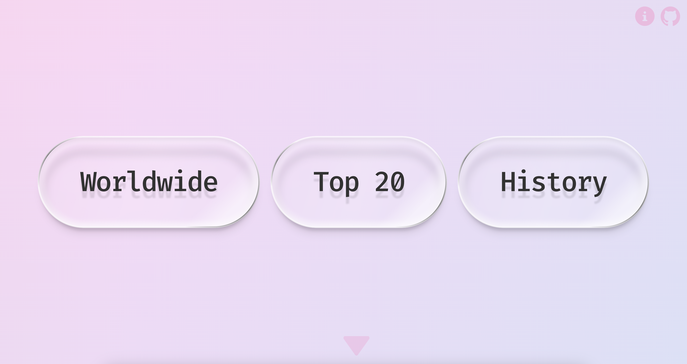
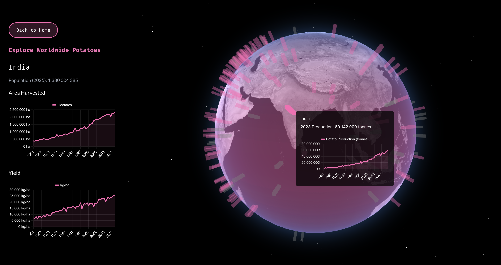

# Worldwide Potatoes

## Description

[**Worldwide Potatoes**](https://www.worldwidepotatoes.com) is a collection of data visualizations and information about potatoes. Everything in the app is entirely 100% factual.

## Data

The potato production data is sourced from the **FAO**1, or Food and Agriculture Organization of the United Nations.

The word frequency data is sourced from the **Google Ngram Viewer**2. The **Google Ngram Exporter**3 was used to extract the data.

Did something strange happen in Canada in the early 1990s? The data says yes.

## UI

## Walkthrough

A walkthrough of the app can be found [here](https://youtu.be/G9r2pxOxqs0).

## Acknowledgements

Thank you for the CSS _Petr Knoll_ and _Wakana Y. K._.

## License

MIT License.

## References

1[FAO](https://www.fao.org/faostat/en/#data/QCL) 2[Google Ngram Viewer Query: "potato"](https://books.google.com/ngrams/graph?content=potato&year_start=1597&year_end=2022&corpus=en&smoothing=3&case_insensitive=false) 3[Google Ngram Exporter](https://github.com/jouniverse/google-ngram-exporter)
